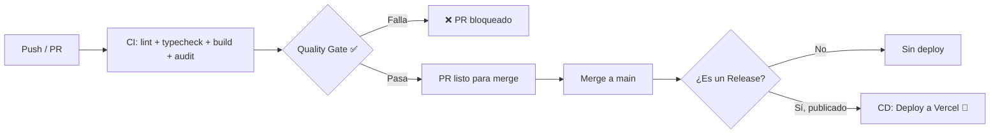

# 🚀 Guía: Desactivar Deploys Automáticos en Vercel

Para que Vercel **solo despliegue cuando se publique un Release** (y no en cada push o PR), hay que hacer dos cosas:

## 1. Desactivar deploys automáticos en Vercel

1. Ve a [vercel.com/dashboard](https://vercel.com/dashboard) → tu proyecto → **Settings**
2. En el menú lateral: **Git**
3. Desactiva la opción **"Deploy on Push"** (o equivalente según versión del panel)
4. Alternativamente, añade un archivo `vercel.json` en la raíz con:

```json
{
  "github": {
    "enabled": false
  }
}
```

> [!IMPORTANT]
> Con `github.enabled: false`, Vercel deja de escuchar el webhook de GitHub por completo. El deploy solo ocurrirá cuando el workflow `cd.yml` llame a la CLI de Vercel explícitamente.

---

## 2. Añadir los secretos necesarios en GitHub

En tu repositorio de GitHub → **Settings → Secrets and variables → Actions**, añade:

| Secret | Cómo obtenerlo |
|--------|---------------|
| `VERCEL_TOKEN` | [vercel.com/account/tokens](https://vercel.com/account/tokens) → crear token |
| `DATABASE_URL` | La misma cadena de conexión de Supabase que tienes en `.env` |
| `JWT_SECRET` | El mismo valor que tienes en `.env` |

### Obtener VERCEL_ORG_ID y VERCEL_PROJECT_ID
Ejecuta en la raíz del proyecto (solo una vez):
```bash
npx vercel link
```
Esto crea `.vercel/project.json` con los IDs. **No hace falta** añadirlos como secretos porque el workflow usa `vercel pull` que los obtiene automáticamente del token.

---

## 3. Cómo hacer un deploy

### 🏷️ Via Release (recomendado)
1. En GitHub → **Releases → Draft a new release**
2. Crea un tag (ej: `v1.0.0`), pon título y descripción
3. Pulsa **"Publish release"**
4. El workflow `cd.yml` se dispara automáticamente → deploy a producción

### 🖱️ Via disparo manual
1. En GitHub → **Actions → CD — Deploy to Vercel**
2. Pulsa **"Run workflow"** → selecciona entorno → **Run**

---

## 4. Flujo completo resultante


